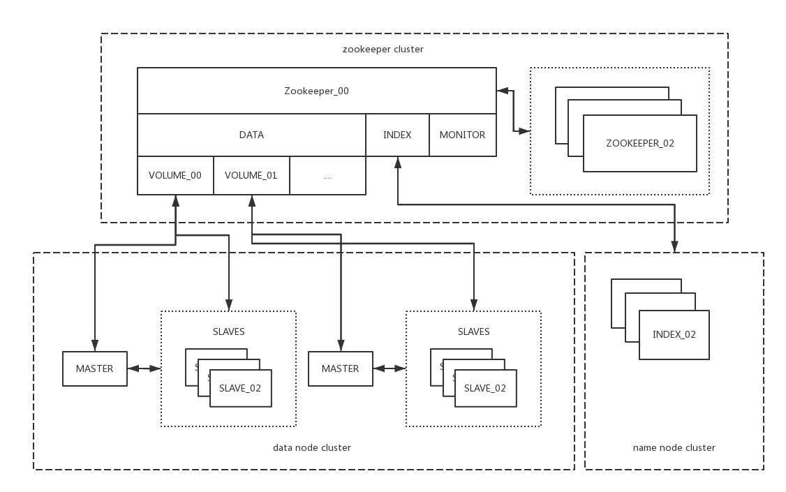

# NDFS (Nero Distributed File System) 
## 


## 

## 用户手册
## cenocloud 分布式基础中间件技术组
#  
## Overview


## 关于配置
### NDFS提供了简单明了的配置方式 config.properties
#### 
```
# 文件块列表文件
chunk.ListFilePath=/Users/neroyang/project/iotcloud/middleware/ndfs/test_data/header.list
# 文件块存放路径
chunk.FilePath=/Users/neroyang/project/iotcloud/middleware/ndfs/test_data/
# 数据节点启动监听端口
server.host=localhost
server.port=1080
# 注册中心地址，若有多个，使用分号分隔
zookeeper.host=www.cenocloud.com:2181
# 注册中心超时时间
zookeeper.timeout=10000
# 索引节点负载均衡策略 默认轮询
load-balance.type=polling
# 节点名称
node.name=data_01
# 节点备注
node.note=data node 01
# 节点虚拟卷/命名空间
node.volume=DATA_01
# 节点类型 Master 主，Slave 备
node.type=Master
# 若节点类型为Master，该项配置需要注释，若节点类型为salve，则需要填写需要备份的节点名称
# node.master = null
# 数据防篡改， 打开意味着所有对数据的修改和删除操作将失效，并且会产生文件hash链，进行防篡改校验，默认关闭
data.tamper-proof.enable=false
# 最大允许上传文件
data.max-upload-size=5
# 文件块大小，单位为兆字节，默认64M，参考 64/128/256/... 建议不做修改
data.chunk-size=64
# 节点间操作校验秘钥，若配置就意味着与该节点通信的所有节点均需配置，包括namenode，client需带着秘钥访问
auth.enable=false
auth.key=2186394109e2427b80710fb561485184
auth.secret=2186394109e2427b80710fb5614851842186394109e2427b80710fb561485184
```
### 配置解读
#### 文件块列表文件
##### 文件块列表文件是

## 关于部署
### NDFS提供了简单易用的启动脚本
#### 索引节点 ndfsIndexServer.sh
``` bash
#!/usr/bin/env bash
```
#### 数据节点 ndfsDataServer.sh
``` bash
#!/usr/bin/env bash
```

## SDK / API
### 客户端使用
#### 文件查询：
```java
public class IndexDemo {
    public static void main(String[] args) throws IOException {
        final DFSClient dfsClient = DFSClient.getInstance();
        try {
            dfsClient.init();
        } catch (NoSuchMethodException e) {
            e.printStackTrace();
        } catch (IllegalAccessException e) {
            e.printStackTrace();
        } catch (InstantiationException e) {
            e.printStackTrace();
        }

        // 错误事件监听
        dfsClient.setDfsErrorListener(new DFSErrorListener() {

            @Override
            public void onError(Response<Object> response) {
                // 错误处理
                switch (response.getCode()){
                    case 1: // 未知的请求类型
                        System.out.println(response.getMsg());
                        break;
                    case 2: // 节点认证失败
                         System.out.println(response.getMsg());
                        break;
                    // todo ....
                }
            }
        });

        final IIndexService fileService = dfsClient.getRemoteProxy(RpcType.INDEX, IIndexService.class);
        DataPosition dataPosition = fileService.getFileByHashCode(UUID.randomUUID().toString());
        System.out.println(dataPosition);
    }
}

```
#### 文件上传：

#### 文件下载：
```java

```
```
#### 文件删除：
